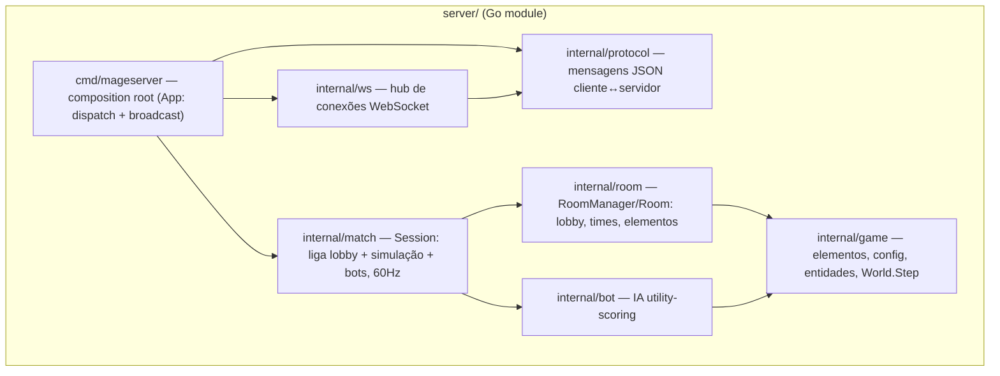

# Mage Craft — servidor Go

Servidor autoritativo do Mage Craft: lobby de salas por time (NxN, até 6x6),
seleção de elemento único por mago dentro do time, preenchimento de vagas com
bots, e um loop de simulação 60Hz (movimento, carga/lançamento, projéteis por
elemento, dano/knockback/slow/interrupt, poças, vidas/respawn, fim de round).

Ver `../GDD.md` (§7, §10.2, §14) para o contrato de produto e
`../multiplayer-plan.md` para o histórico de decisão (o plano original
assumia Node.js reaproveitando a simulação TypeScript; a implementação real é
este módulo Go independente, que reimplementa a simulação do zero).

## Rodando

```bash
cd server
go run ./cmd/mageserver
```

Variáveis de ambiente:

| Variável | Default | Descrição |
| --- | --- | --- |
| `PORT` | `8080` | Porta HTTP/WebSocket do servidor |

Endpoints:

- `GET /healthz` — health check simples (`200 ok`).
- `GET /ws?id=<clientId>` — upgrade para WebSocket; `id` é opcional (o
  servidor gera um `anon-N` se omitido). Ver protocolo abaixo.

## Testes

```bash
cd server
go test ./...        # suíte completa
go test ./... -race  # com detector de corrida (recomendado após mexer em internal/match)
```

A suíte cobre cada pacote isoladamente (TDD, seams por pacote) mais um smoke
test ponta a ponta em `cmd/mageserver/integration_test.go` que sobe o
servidor real (via `httptest`), conecta dois clientes WebSocket de verdade e
percorre o fluxo completo: `create_room` → `join_room` → `select_team` →
`select_element` → `start_match` → `input` → recebe um `snapshot` da
simulação rodando.

## Arquitetura (pacotes)



| Pacote | Responsabilidade |
| --- | --- |
| `internal/game` | Catálogo de 7 elementos, config de tuning, entidades (`Mage`/`Projectile`/`Puddle`) e `World.Step` (movimento, charge/lançamento, colisão, dano/knockback/slow/interrupt, poça, vidas/respawn, fim de round) |
| `internal/bot` | IA utility-scoring simplificada (retreat/attack/advance/wander), dificuldades `easy`/`normal`/`hard` |
| `internal/room` | `RoomManager`/`Room` — lobby puro: join/leave, times, seleção de elemento com validação de unicidade por time, bots, `StartMatch` (constrói o `game.World`). Não depende de `internal/bot` nem de transporte. |
| `internal/match` | `Session` — o único ponto que conhece `room` **e** `bot`: serializa lobby + tick de simulação atrás de um mutex, roda o loop 60Hz (`RunLoop`/`Tick`) e expõe callbacks (`OnSnapshot`, `OnRoundEnd`) como dados puros (sem depender de `protocol`) |
| `internal/protocol` | Structs JSON das mensagens cliente↔servidor + `PeekType` para dispatch |
| `internal/ws` | Hub de conexões WebSocket (upgrade, leitura/escrita, broadcast) — não sabe nada sobre salas/protocolo |
| `cmd/mageserver` | Composition root (`App`): decodifica mensagens do protocolo, chama `match.Session`, serializa e faz broadcast das respostas via `ws.Hub` |

## Protocolo WebSocket (resumo)

Todas as mensagens são JSON planas com um campo `"type"` (ver
`internal/protocol/protocol.go` para os structs completos e `PeekType` para o
dispatch).

**Cliente → Servidor**

| `type` | Campos | Descrição |
| --- | --- | --- |
| `create_room` | `teamSize` | Cria sala com times de 1 a 6 (capacidade = 2× teamSize) |
| `join_room` | `roomId`, `name` | Entra numa sala existente (ainda sem time) |
| `select_team` | `team` (0\|1) | Escolhe/troca de time, alocando uma vaga |
| `select_element` | `element` | Escolhe 1 dos 7 elementos do catálogo (GDD §8.1); rejeitado se já usado no time |
| `add_bot` | `team`, `difficulty` | Preenche uma vaga vazia com bot (`easy`\|`normal`\|`hard`); elemento livre é escolhido automaticamente |
| `remove_bot` | `slotId` | Remove um bot, liberando vaga e elemento |
| `set_ready` | `ready` | Alterna o estado "pronto" no lobby |
| `start_match` | — | Pede início da partida (valida vagas + elementos); dispara o loop 60Hz |
| `input` | `move`, `aim`, `charging`, `release` | Input do mago durante a partida |

**Servidor → Cliente**

| `type` | Campos | Descrição |
| --- | --- | --- |
| `room_state` | `roomId`, `teamSize`, `state`, `slots[]` | Broadcast a cada mudança de lobby |
| `match_start` | — | Loop de simulação 60Hz iniciado |
| `snapshot` | `tick`, `mages[]`, `projectiles[]`, `puddles[]` | Snapshot do mundo (~20Hz, a cada 3 ticks) |
| `round_end` | `winnerTeam` | Time perdedor teve todos os magos eliminados (sem vidas) |
| `error` | `message` | Ação rejeitada / mensagem inválida |

## Simplificações conhecidas do v1 (registradas no GDD como próximos passos)

- **Sem obstáculos/cover/linha de visão** na simulação — arena v1 é um
  retângulo aberto (`internal/game/config.go`).
- **Desconexão em partida** apenas congela o input daquele mago (ele para de
  se mover/atacar, mas continua no mundo); forfeit ou bot-takeover ainda não
  implementado.
- **Sem host explícito** — qualquer jogador na sala pode chamar `add_bot`/
  `remove_bot`/`start_match`, não só quem criou a sala.
- **Sem limpeza de salas encerradas** — `room.Manager` mantém salas em
  memória indefinidamente; ok para dev/testes, precisa de um TTL/GC antes de
  produção.
- **Integração com o cliente** (Three.js/Preact) com este protocolo
  WebSocket ainda não começou — ver a skill `threejs-gameplay-systems`
  quando essa fase começar.
