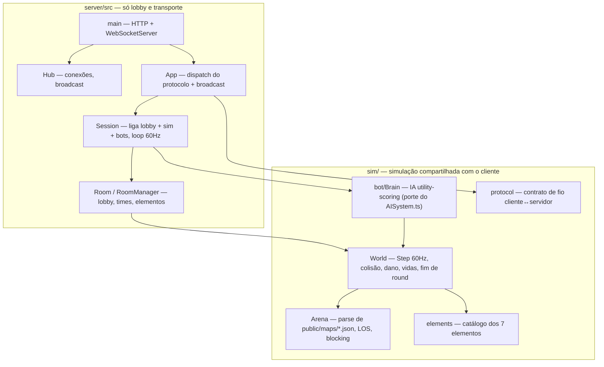

# Mage Craft — servidor autoritativo (Node)

Lobby de salas por time (NxN, até 6x6), seleção de elemento único por mago
dentro do time, preenchimento de vagas com bots, e um loop de simulação 60Hz
(movimento, carga/lançamento, projéteis por elemento, dano/knockback/slow/
interrupt, poças, vidas/respawn, fim de round).

**O servidor não tem simulação própria.** Ele importa `sim/` — o mesmo código
TypeScript que o cliente usa. Antes existia um módulo Go que reimplementava a
simulação do zero, e mantê-lo em sincronia com o cliente à mão foi a maior
fonte de bugs do projeto (mira, knockback, movimento travado, bot burro, mapa
diferente). Ver `../multiplayer-plan.md` para o histórico e `../GDD.md`
(§7, §10.2, §14) para o contrato de produto.

## Rodando

```bash
npm run dev:server        # tsx watch, recarrega ao salvar
npm run build:server      # bundle -> dist-server/main.js
npm run start:server      # roda o bundle
```

Variáveis de ambiente:

| Variável | Default | Descrição |
| --- | --- | --- |
| `PORT` | `8080` | Porta HTTP/WebSocket do servidor |

Endpoints:

- `GET /healthz` — health check simples (`200 ok`).
- `GET /ws?id=<clientId>` — upgrade para WebSocket; `id` é opcional (o
  servidor gera um `anon-N` se omitido).

## Testes

```bash
npm test                  # cliente + sim + servidor, uma suíte só
```

Não há suíte separada por linguagem: `sim/**/*.test.ts` cobre a simulação
(incluindo checagens de paridade contra as tabelas de obstáculo do cliente),
`server/src/*.test.ts` cobre lobby, sessão e o protocolo ponta a ponta
(`App.test.ts` injeta um transporte gravador e percorre `create_room` →
`join_room` → `select_team` → `select_element` → `add_bot` → `start_match` →
`input` → `snapshot` → `round_end`).

## Arquitetura



| Módulo | Responsabilidade |
| --- | --- |
| `sim/World.ts` | `step()` — movimento, charge/lançamento, colisão, dano/knockback/slow/interrupt, poça, vidas/respawn, fim de round |
| `sim/Arena.ts` | Carrega `public/maps/*.json` (o mesmo arquivo que o cliente renderiza): obstáculos, bloqueio de movimento/projétil por altura, linha de visão |
| `sim/elements.ts` | Catálogo dos 7 elementos (números de combate) |
| `sim/bot/Brain.ts` | IA utility-scoring (retreat/takeCover/attack/advance/wander + dodge), dificuldades `easy`/`normal`/`hard` |
| `sim/protocol.ts` | Tipos das mensagens JSON — importado pelos **dois** lados |
| `server/src/Room.ts` | Lobby puro: join/leave, times, unicidade de elemento por time, bots, espectador/claim, `startMatch()` |
| `server/src/Session.ts` | O único ponto que conhece lobby **e** IA: roda o loop 60Hz e expõe callbacks (`onSnapshot`, `onRoundEnd`) como dados puros |
| `server/src/App.ts` | Decodifica o protocolo, chama `Session`, serializa e faz broadcast |
| `server/src/Hub.ts` | Conexões WebSocket (registro, envio, broadcast) — não sabe nada sobre salas/protocolo |

Sobre concorrência: o servidor Go precisava de um mutex em `Session` para
serializar mutações de lobby contra a goroutine de tick. No Node o event loop
já garante isso, então esse mutex simplesmente não existe — não foi traduzido.

## Protocolo WebSocket (resumo)

Todas as mensagens são JSON planas com um campo `"type"` (ver
`../sim/protocol.ts` para os tipos completos).

**Cliente → Servidor**

| `type` | Campos | Descrição |
| --- | --- | --- |
| `create_room` | `teamSize`, `fillBots?`, `botDifficulty?` | Cria sala (1–6); com `fillBots` o server preenche vagas restantes após o host escolher elemento |
| `join_room` | `roomId`, `name` | Lobby: entra sem time. `in_progress`: entra como **espectador** |
| `list_rooms` | — | Pede o catálogo de salas `lobby` + `in_progress` |
| `select_team` | `team` (0\|1) | Escolhe/troca de time, alocando uma vaga |
| `select_element` | `element` | Escolhe 1 dos 7 elementos (GDD §8.1); unicidade por time |
| `add_bot` | `team`, `difficulty` | Preenche uma vaga vazia com bot (`easy`\|`normal`\|`hard`) |
| `remove_bot` | `slotId` | Remove um bot, liberando vaga e elemento |
| `claim_slot` | `slotId` | Espectador reserva um bot para o **próximo rematch** (bot segue jogando) |
| `set_ready` | `ready` | Alterna o estado "pronto" no lobby |
| `start_match` | — | Inicia (ou reinicia) a partida; dispara o loop 60Hz |
| `input` | `move`, `aim`, `charging`, `release` | Input do mago durante a partida (no-op para espectador). `aim` é um **ponto** no mundo, não uma direção |

**Servidor → Cliente**

| `type` | Campos | Descrição |
| --- | --- | --- |
| `room_state` | `roomId`, `teamSize`, `state`, `slots[]`, `spectators[]?`, `youRole?`, `fillBots?` | Mudança de lobby / rematch |
| `room_list` | `rooms[]` | Resposta a `list_rooms` |
| `match_start` | — | Loop de simulação 60Hz iniciado |
| `snapshot` | `tick`, `mages[]`, `projectiles[]`, `puddles[]` | Snapshot do mundo (~20Hz); inclui espectadores |
| `round_end` | `winnerTeam` | Fim da rodada → sala volta a `lobby` (rematch); claims aplicados |
| `error` | `message` | Ação rejeitada / mensagem inválida |

## Limitações conhecidas

- **Sem path planner.** Bots usam um probe curto + sidestep (`steerTo`) em vez
  do `PathGrid` do cliente, então podem raspar numa parede longa em vez de
  contorná-la.
- **Desconexão em partida** apenas congela o input daquele mago (ele para de se
  mover/atacar, mas continua no mundo); forfeit / bot-takeover mid-round ainda
  não existe (join mid-match é via espectador + claim no rematch).
- **Sem host explícito** — qualquer jogador na sala pode chamar `add_bot` /
  `remove_bot` / `start_match`, não só quem criou a sala.
- **Sem limpeza de salas encerradas** — `RoomManager` mantém salas em memória
  indefinidamente; ok para dev/testes, precisa de TTL/GC antes de produção.
